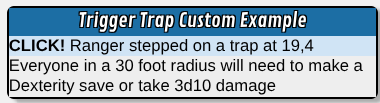

# Trigger Traps

This setup uses [ScriptCards Triggers](https://wiki.roll20.net/Script:ScriptCards#Triggers) to trigger actions when a token enters or moves through a trigger token's area.

## Setup

1. Install ScriptCards - minimum version of 3.0.12
2. Create a character named ScriptCards_Triggers - must be a non-Beacon character sheet currently
3. Create a character named ScriptCards_Storage - must be a non-Beacon character sheet currently
4. Mod API Sandbox must be restarted after creating ScriptCards_Triggers character and ScriptCards_Storage character
5. Create ability named `change:graphic` on ScriptCards_Triggers character
6. Copy change_graphic_trigger.scard contents into `change:graphic` ability on ScriptCards_Triggers character
7. Run trigger_manager.scard to edit configuration to your desired state. Pay particular attention to the FlyMarker variable to use whatever marker you have to mark a flying character

## Actions

Trigger traps can use one of the built-in options or will run a custom ability stored on a character sheet "mule".

### Built-In Actions

There are four built-in actions that can be run: description, playaudio, teleport, and ambush. Built-in types can optionally run additional actions if those locations are set. The additional actions are send text to one or two locations, play an audio track, or perform a visual effect.

#### Description Action

Description triggers are to send text to one or two locations. When populated text can be sent to one or two of the following options: whisper text to the triggering player, whisper text to the gm, or send text to chat for all to see.

Description triggers can also play an audio track or perform a visual effect if those locations are populated.

#### Playaudio Action

Playaudio triggers are to play an audio track when triggered.

Playaudio triggers can also send text to one or two location as well as perform a visual effect if those locations are populated.

#### Teleport Action

Teleport triggers will move the triggering token to a new location, if on the same page, or if the teleport location is on a different page, then move the triggering token to the gmlayer and either spawn a new token on the other page or if the triggering character already has a token on that page, then move that token to the teleport target and sync token properties of the triggering token.

Teleport locations are formatted like [PageName#](X,Y|target_token_id). If you leave out the PageName#, the teleport will be on the same page as the trigger token. The location is either in the form of X,Y square coordinates or the token id of another token. For example a location of 4,12 would be the 4th column from the left and 12th row from the top. 1,1 would be the top left square with 2,1 being the square to its right, and 1,2 would be the square right below it.

Teleport triggers can also send text to one or two location, play an audio track, or perform a visual effect if those locations are populated.

Example teleport triggers:
* `4,5` - Teleport the 4th column from the left and 5th row from the top on the same page
* `-targetTokenId` - Teleport to the location of that token's top and left coordinates on the same page
* `ForestPage#3,6` - Sends triggering token to the gmlayer and checks the `ForestPage` for a token linked to the same character as the triggering token. If a linked token is found on the `ForestPage`, then that existing token will be moved to the 3rd column from the left and 6th row from the top and token properties will be synced from the triggering token. If no existing token is found, a new token will be spawned at 3,6 with the same properties as the triggering token.

#### Ambush Action

Ambush triggers will move the listed token ids to the object layer.

Ambush triggers can also send text to one or two location, play an audio track, or perform a visual effect if those locations are populated.

Note that the ability to use EncounterHelper encounters is not yet implemented. Hopefully it will be available in the future.

### Custom Actions

Custom actions will use ScriptCards `runaction` ability to run an ability stored on a character sheet. The `runaction` will send four parameters to the ability. The token id of the trap itself will be sent as `[REPL1]`, the token id of the triggering token will be sent as `[REPL2]`, the triggering location will be sent as `[REPL3]` as represented by X,Y square coordinates, and the trap area will be sent at `[REPL4]` which represents the target options of `area`, `ground`, or `air`.

Note that custom actions will not output text, play audio, or do a visual effect regardless of those locations being populated. Custom actions are entirely under your control and will only do what the custom ability does.

#### Custom Action Example
```text
!script {{
  --/|ScriptCards runaction function parameters replace REPLX once, so we use those to set variables
  --&TrapTokenID|[REPL1]
  --&TriggeringTokenID|[REPL2]
  --&TriggeringLocation|[REPL3]
  --&TriggerArea|[REPL4]

  --/|Since the trigger trap for custom actions does not use any token locations
  --/|Custom actions have access to customize any token location for its own purposes
  --/|without interference from any built-in trigger trap locations
  --&SaveType|[*[&TrapTokenID]:t-bar1_value]
  --&DamageDice|[*[&TrapTokenID]:t-bar2_value]
  --&Radius|[*[&TrapTokenID]:t-bar3_value]

  --/|The rest is just ScriptCards displaying an example
  --#title|Trigger Trap Custom Example
  --+CLICK!|[*[&TriggeringTokenID]:t-name] stepped on a trap at [&TriggeringLocation]
  --+|Everyone in a [&Radius] radius will need to make a [&SaveType] save or take [&DamageDice] damage
}}
```


## Naming Conventions

Trigger tokens use naming conventions to declare the type of trigger. The smallest trigger name is `trigger:actiontype`. Other options can be specified `trigger:Area:Active:ContinueMoving:Action`.

The other options are optional and if omitted will use their default values.

### Trigger Options

* Area - The triggering area for the trap. Valid options are `area`, `ground`, and `air`. Default: `area`. Area will trigger for any token entering the trigger's location. Ground will only trigger if the triggering token does not have the status marker set as the `FlyingMarker`. Air will only trigger if the triggering token does have the status marker set as the `FlyingMarker`.
* Active - Valid options `onetime` and `alwaysactive`. Default: `onetime`. Onetime triggers will trigger only if the `ActivationMarker` is present and then the `ActivationMaker` is removed. Alwaysactive will remain active after a token triggers it. 
* ContinueMoving - Valid options are `stop` and `continue`. Default: `stop`. Stop means the first trigger is the only trigger that will be processed. Continue means that additonal token movement could activate additional triggers encountered.

Note that `ReturnTokenOnStop` option is not yet implemented that would move the token back to the triggering location for a token set to `stop`.

Examples:
* `trigger:ambush` - Ambush trigger with an area of `area`, ie both ground and air, `onetime` so will only trigger when the status marker set as the `ActivationMaker` is present, and `stop`, meaning no other triggers will be triggered regardless of the token's following movement.
* `trigger:ground:alwaysactive:teleport` - Teleport trigger with area of ground meaning tokens with the FlyingMarker status marker will not trigger is always active and stop other triggers from processing.
* `trigger:continue:description` - Display text when either flying and non-flying tokens enter and continue processing other triggers if the triggering token moves into their areas.
* `trigger:air:Earthbind` - Tokens with the FlyingMarker status marker will trigger and an ability named `Earthbind` will be run. Defaults of `onetime` and `stop`.

## Configuration

### General Configuration

* LogLevel - sets the level of messages that will appear in the Mod Console. valid values debug, info, warn, error, fatal
* EnableTriggerDetection - set to true and the Trap detection trigger will process. any other value will disable
* ReturnTokenOnStop - Currently not implemented. Will eventually return the triggering token back to the first trigger location that is set to "stop"
* FlyMarker - Token statusmarker used to indicate the token is flying. Flying tokens will not trigger traps set to "ground"
* ActivationMarker - The status marker for "onetime" triggers to indicate if they are active
* CustomAbilityMule - The name of the character where custom abilities are stored. Currently must be a non-Beacon sheet
* triggerTokenNamePrefix - The prefix of the token's name used to indicate trigger. Set to trigger:. Probably shouldn't change this right now since I'm guessing everything will break
* scStoredVariablePrefix - The prefix used to fetch stored configuration. Again this might break if you change it

### Action Configuration

* WhisperToTriggererLocation - The token location where text is stored that will be whispered to the triggering token's player. Default - bar1_max
* WhisperToGMLocation - Token location where text is stored that will be whispered to the GM when the token is triggered. Default - bar2_value
* BroadcastToChatLocation - Token location where text is stored that will be sent to chat for everyone to see. Default - bar2_max
* VisualEffectLocation - Token location that stores visual effects to be triggered. Default - bar3_value
* PlayaudioLocation - Token location that stores the name of the track to play on trigger. Default - bar3_max
* TeleportLocation - Token location that stores the end location for a "teleport" trigger. Default - bar1_value
* AmbushLocation - Token location that stores the token ids to move from the gmlayer to the objects layer. Default - bar1_value

Note: Currently setting all 3 text fields will result in an error. Only 1 or 2 text fields can be set and work.

## Known Limitations

Currently only pages with a square grid are supported. Pages with the grid disabled or set to hexes are not currently supported.

Stacking trigger traps is not supported. Not saying it definitely will not work but it there may be unexpected results. If you have a real use case for needing stacked trigger trap tokens, please open a Github issue describing the use case and what you are looking to accomplish.

## Utility Script

In addition to the trigger, there is also another ScriptCard to help manage triggers. The Trigger Manager utility will spawn a new trigger token, activate existing triggers, and edit and save trigger trap configuration variables.

### Trigger Manager Actions

#### List Trigger Tokens

#### Create Trigger Tokens

When creating tokens, the **Area**, **Active**, and **Continue** are optional. If they are not set, the manager will show **default** which is the first option in their respective lists. Default options can be found [here](#trigger-options).

#### Show Configuration

Shows the current configuration and allows edits to change the configuration values.

##### Trigger Manager Configuration

* LogLevel - Level of which log messages show. Default: info. Valid options: debug, info, warn, error
* SpawnTriggerActivated - True/False whether "onetime" activation triggers should spawn already activated. Default: true

##### Trigger Spawn Configuration

###### Token Properties

* imgsrc - URL of the image for the token. Default: URL to a plain square token
* layer - which page layer to spawn on. Default: gmlayer Valid options: objects, gmlayer, map

###### Color Configuration

These are the hex code values that are used for tint_color token property. Each trigger trap type can be set independently.

* TeleportTokenColor - Default: #ff0000
* AmbushTokenColor - Default: #00ff00
* DescriptionTokenColor - Default: #0000ff
* PlayaudioTokenColor - Default: #ffff00
* CustomTokenColor - Default: #ff00ff
